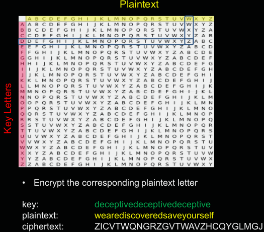
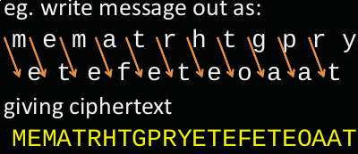
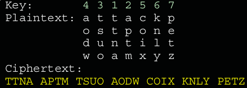

# Introduction to Cryptography

## Termiology
- plaintext - original message
- ciphertext - coded message
- cipher - algorithm for transforming plaintext to ciphertext
- key - info used in cipher, known only to sender/receiver
- encipher - converting plaintext to ciphertext
- decipher - recovering ciphertext from plaintext
- cryptography - study of encryption principles/methods
- cryptanalysis - study of principles/methods of deciphering ciphertext without knowing the key.
- cryptology - field of both cryptography and cryptanalysis
- **Unconditional security** - No matter how much computer power or time is available, the cipher cannot be broken since the ciphertext provides insufficient information to uniquely determine the corresponding plaintext.
- **Computational security** - Given limited computing resources, the cipher cannot be broken.

## Symmetric Encryption
Sender and receiver share a common key. All classical encryption algorithms are symmetric. It is the most widely used.

### Requirements
- A strong encryption algorithm
- A secret key known only to sender & reciever.

Requires a secure channel to distribute the key.

## Cryptanalysis

2 General approaches to attacking a conventional encryption scheme, **brute-force** and **cryptanalytic**.

### Brute Force Attack
- Try all possible keys

### Cryptanalytic Attack
- Based on the nature of the algorithm
- General characteristic of plaintext
- Sample of plaintext-ciphertext pairs

**Categories**
- ciphertext only - only knows the algorithm & ciphertext
- known plaintext - know/suspect plaintext & ciphertext
- chosen plaintext - select plaintext and obtain ciphertext
- chosen ciphertext - select ciphertext and obtain plaintext
- chosen text - select plaintext or ciphertext to en/decrypt

The objective of attacking an encryption system is to **recover the key in use** rather than simply to recover the plaintext of a single ciphertext.

## One Time Pad
It is unbreakable since the ciphertext bears no statistical relationship to the plaintext. For any plaintext & any ciphertext there exists a key mapping one to the other.

However it is not widely used as the key can only be used once.

## Steganography
It hides the existence of a message, however it has high overhead to hide relatively low amount of information.

# Classical Ciphers

## Substitution Ciphers
Letters of the plaintext are replaced by other letters, numbers or symbols.

### Caesar Cipher
The earliest known substitution cipher, created by Julius Caesar used in military affairs.

ABC -> DEF (ROT3)

### Monoalphabetic Cipher
Arbitrarily map each plaintext letter to a different random ciphertext letter.

ABC -> %#@

Vulnerable to [Frequency analysis](https://en.wikipedia.org/wiki/Frequency_analysis).

## Polyalphabetic Ciphers

[Wiki](https://en.wikipedia.org/wiki/Polyalphabetic_cipher)

The same plaintext letters can be replaced by different ciphertext alphabets. It makes cryptanalysis harder with more alphabets to guess and flatter frequency distribution.

BEE -> FHG

A key selects which ciphertext alphabet is used to substitute each letter of the message. Apply each key alphabet in turn, repeat from the start after end of key is reached.

### Playfair Cipher
Invented by Charles Wheatstone in 1854, but named after his friend Baron Playfair. It was used by US & British military in WWI and WWII.

[Wiki](https://en.wikipedia.org/wiki/Playfair_cipher)

1. If both letters are the same (or only one letter is left), add an "X" after the first letter. Encrypt the new pair and continue. Some variants of Playfair use "Q" instead of "X", but any letter, itself uncommon as a repeated pair, will do.
2. If the letters appear on the same row of your table, replace them with the letters to their immediate right respectively (wrapping around to the left side of the row if a letter in the original pair was on the right side of the row).
3. If the letters appear on the same column of your table, replace them with the letters immediately below respectively (wrapping around to the top side of the column if a letter in the original pair was on the bottom side of the column).
4. If the letters are not on the same row or column, replace them with the letters on the same row respectively but at the other pair of corners of the rectangle defined by the original pair. The order is important – the first letter of the encrypted pair is the one that lies on the same row as the first letter of the plaintext pair.

Security is much improved over monoalphabetic ciphers, there are 26 x 26 = 676 digraphs as compared to 26 for monoalphabetic encryption. It can be broken give a few hundred letters, since it still has much of the plaintext structure.

### Vigenere Cipher
Simplest polyalphabetic substitution cipher.

Assuming the key is `deceptive`.

Letter frequencies are obscured but not totally lost.

If 2 identical sequences of plaintext letters occur at a distance that is an integer multiple of the keyword length, they will generate identical ciphertext sequences.

## Transposition Ciphers
Hide the message by rearranging the letter order without altering the actual letters used. Can be recognised since they have the same frequency distribution as the original text.

### Rail Fence Cipher
Write message letters out diagonally over a number of rows then read off the ciphertext row by  row.

### Row Transposition Ciphers
Write letters of the message out in rows over a specified number of columns, then reorder the columns according to some key before reading off the rows.

## Rotor Machines
Before modern ciphers, rotor machines were the most common complex ciphers in use. Widely used in WWII for example Enigma.

It used a series of cylinders each giving one substitution, which rotated and changed after each letter was encrypted.

## Product Ciphers
Ciphers using only substitutions or transpositions are not secure because of language characteristics. Modern ciphers use a combination of these.