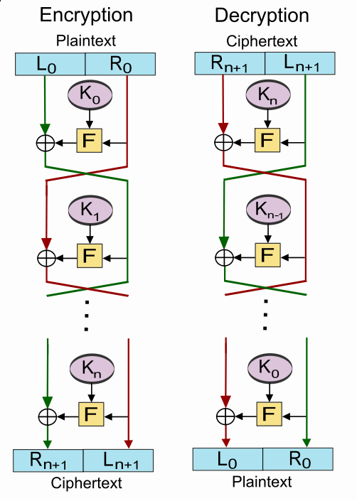
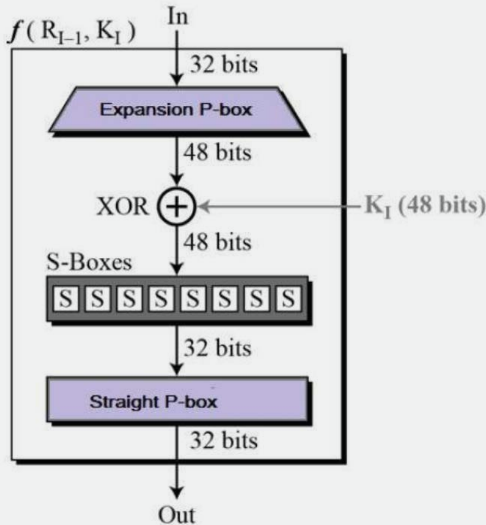
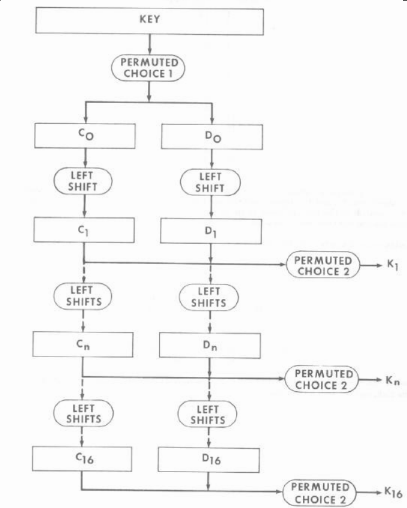

# Chapter 2

## Stream Ciphers
Process messages a bit or byte at a time. Uses a pseudo random keystream XOR with plaintext bit by bit. As secure as block cipher with same key size if designed properly. Usually simpler and faster.

### Design Considerations
- No repetitions over long period
- Statistically random
- Depends on large enough key to avoid brute force

### Common Stream Ciphers
- RC4
- Salsa20

## Block Ciphers
Process messages in blocks, typical block size is 64 or 128 bits. More common than stream ciphers, because it has broader range of applications and allow more complex design.

## Substitution-Permutation Networks
Proposed by Claude Shannon in 1949. Basis of modern block ciphers. Based on 2 primitive cryptographic operations **substitution (S-box)** and **permutation (P-box)**.

Provide **confustion** and **diffusion** of message and key.

### Confusion
Makes relationship between **ciphertext and key** as complex as possible so as to prevent attempts to discover key. (**substitution**)

### Diffusion
Seeks to make the statistical relationship between the **ciphertext and plaintext** as complex as possible in order to prevent attempts to deduce the key. (**permutation** or **transposition**)

## Feistel Scheme
Widely used to illustrate block cipher design principles.

**Construction of Feistel Cipher**
- Split input block into 2 halves
- Using data from right half
- Apply substitution + permutation + subkey
- XOR with left half
- Swapping halves in the next cycle

**Considerations**
- Block size
- key size
- number of rounds
- subkey generation algorithm
- round function

# DES
[Paper](https://csrc.nist.gov/csrc/media/publications/fips/46/3/archive/1999-10-25/documents/fips46-3.pdf)

Widely used block cipher specified and adpoted by US government. Broken due to low key length.

Encrypts 64 bit data using 56 bit key.

## Encryption Steps

1. Inital Permutation
2. 16 key dependent round functions
3. Final permutation

## Inital Permutation
The inital and final permutations are straight Permutation boxes (P-boxes) that are the inverses of each other.

To inverse a permutation box you take the position as the number and the number as the position.

## Round Structure

## Substitution Boxes
[Wiki](https://en.wikipedia.org/wiki/DES_supplementary_material#Substitution_boxes_(S-boxes))

8 different S-boxes working in parallel. Maps 6 bits to 4 bits.

## Decryption
Do encryption steps again using subkeys in reverse order.
1. Final permutation
2. 16 rounds in reverse order
3. Inital permutation

## Key Schedule
Generate 16 subkeys from the secret key.

PC-1 drops bits number 8, 16, 24, 32, 40, 48, 56, 64 which are parity bits.

## Avalanche Effect
DES exhibits strong

1 bit change of the input or key results in approx. half output bits changed.