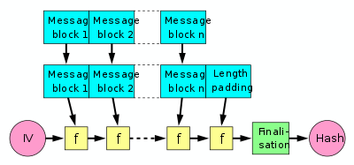

# Hash

## Requirements of Message Security
- Message confidentiality - Adversary cannot decrypt the message
- Message Authentication
    - Intergirty
    - Identity
    - Non-repudiation

## Requirements of Hash Algorithm
- Variable input size
- Fixed output size
- Efficient (Fast)
- First Pre-Image resistance (One way function)
- 2nd Pre-Image resistance (Weak Collision Resistance)
- Collision Resistance
- Pseudo-randomness (Digests from similar message must be very different)

## Merkle-Damgard Construction
[Wiki](https://en.wikipedia.org/wiki/Merkle%E2%80%93Damg%C3%A5rd_construction)

- Append padding and length to message.
- Break input into equal-sized blocks (1024 or 512 bits)
- Apply compression function f iteratively
    - Saves state from one iteration to next
    - Hash is as strong as compression function
- Used by MD5, SHA1, SHA2

## SHA-512
[Wiki](https://en.wikipedia.org/wiki/SHA-2)

**Steps**
1. Append padding bits
2. Append length
3. Initialize hash buffers (words)
4. Process the message in 1024-bit blocks
5. Output the final state value as the resulting hash

### Message Expansion
The 1024 bit message is fed multiple times into the F function as (W)

W0-15 - original message (64bit / word)

W16-79 - Circular left shift by one bit of the XOR of four of the preceding values of W with two of those values subjected to shift and rotate operations.

## First Preimage Resistance
Given the hash of a message, the original message cannot be derived easily.

## Second Preimage Resistance
Given hash of a message, it is difficult to find another message with the same hash.

## Collision Resistance
Computational infeasible to find a pair of messages with the same hash value.

## Birthday Attack
[Wiki](https://en.wikipedia.org/wiki/Birthday_attack)

The security of a n bit hash is actually n/2 bits.

## Application of Hash Algorithms
- Public Key Algorithms
    - Password Logins
    - Encryption Key Management
    - Digital Signatures
- Intergrity Checking
    - Virus and Malware Scanning
- Authentication
    - Secure Web Connections (PGP, TLS, SSH)