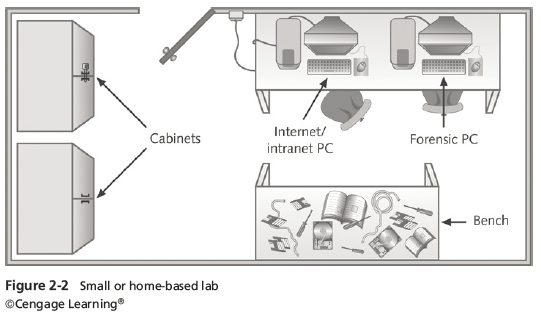

# Chapter 3A

## Forensics Lab Certification Requirements

**Digital forensics lab**  
Where you conduct your investigation store evidence, house your equipment, hardware, and software

**American Society of Crime Laboratory Directors (ASCLD)** offers guidelines for:
Managing a lab, Acquiring an official certification, Auditing lab functions and procedures

**Lab manager duties**
- Set up processes for managing cases
- Promote group consensus in decision making
- Maintain fiscal responsibility for lab needs
- Enforce ethical standards among lab staff members
- Plan updates for the lab
- Establish and promote quality-assurance processes
- Set reasonable production schedules
- Estimate how many cases an investigator can handle
- Estimate when to expect preliminary and final results
- Create and monitor lab policies for staff
- Provide a safe and secure workplace for staff and evidence

**Staff member duties**
- Knowledge and training:
    - Hardware and software
    - OS and file types
    - Deductive reasoning
- Work is reviewed regularly by the lab manager

## Lab Budget Planning
Break costs down into daily, quarterly, and annual expenses. Use past investigation expenses to extrapolate expected future costs. Time management is a major issue when choosing software and hardware to purchase.

**Expenses for a lab include**
- Hardware
- Software
- Facility space
- Training personnel

**Things to consider**
- Estimate the number of computer cases your lab expects to examine
- Identify types of computers you’re likely to examine
- Take into account changes in technology
- Use statistics to determine what kind of computer crimes are more likely to occur
- Use this information to plan ahead your lab requirements and costs
- Identify crimes committed with specialized software, check statistics from the Uniform Crime Report

**When setting up a lab for a private company, check**
- Hardware and software inventory
- Problems reported last year
- Future developments in computing technology

## Acquiring Certification and Training

Update your skills through appropriate training, thoroughly research the requirements, cost, and acceptability in your area of employment

**International Association of Computer Investigative Specialists (IACIS)** created by police officers who wanted to formalize credentials in computing investigations, candidates who complete the IACIS test are designated as a **Certified Forensic Computer Examiner (CFCE)**.

**ISC² Certified Cyber Forensics Professional (CCFP)** requires knowledge of
- Digital forensics
- Malware analysis
- Incident response
- E-discovery
- Other disciplines related to cyber investigations

**High-Tech Crime Network (HTCN)**
Certified Computer Crime Investigator, Basic and Advanced Level
Certified Computer Forensic Technician, Basic and Advanced Level

**EnCase Certified Examiner (EnCE) Certification**
Open to the public and private sectors 
Is specific to use and mastery of EnCase forensics analysis
Candidates are required to have a licensed copy of EnCase

**AccessData Certified Examiner (ACE) Certification**
Open to the public and private sectors
Is specific to use and mastery of AccessData Ultimate Toolkit
The exam has a knowledge base assessment (KBA) and a practical skills assessment (PSA)

**Other Training and Certifications**
EC-Council
SysAdmin, Audit, Network, Security (SANS) Institute
Defense Cyber Investigations Training Academy (DCITA)
International Society of Forensic Computer Examiners (ISFCE)
High Tech Crime Consortium
Computer Technology Investigators Network (CTIN)
Digital Forensics Certification Board (DFCB)
Consortium of Digital Forensics Specialists (CDFS)
Federal Law Enforcement Training Center (FLETC) 
National White Collar Crime Center (NW3C)

## Physical Requirements for a Forensics Lab
Most of your investigation is conducted in a lab. Lab should be secure so evidence is not lost, corrupted, or destroyed. Provide a safe and secure physical environment. Keep inventory control of your assets to know when to order more supplies.

### Secure Facility
Should preserve integrity of evidence data, People working together should have same access level. Brief your staff about security policy.

**Minimum requirements**
- Small room with true floor-to-ceiling walls
- Door access with a locking mechanism
- Secure container
- Visitor’s log 

## Conducting High-Risk Investigations
High-risk investigations demand more security than the minimum lab requirements

**TEMPEST facilities**
- Electromagnetic Radiation (EMR) proofed
- Expensive
- low-emanation workstations is an cheaper alternative

## Evidence Containers
Known as evidence lockers. Must be secure so that no unauthorized person can easily access your evidence.

Container should be made of steel with an internal cabinet or external padlock
If possible, acquire a media safe
When possible, build an evidence storage room in your lab
Keep an evidence log, update it every time an evidence container is opened and closed.

**Recommendations for securing storage containers**
- Locate them in a restricted area 
- Limited number of authorized people to access the container
- Maintain records on who is authorized to access each container
- Containers should remain locked when not in use

**If a combination locking system is used**
- Provide the same level of security for the combination as for the container’s contents
- Destroy any previous combinations after setting up a new combination
- Allow only authorized personnel to change lock combinations
- Change the combination every six months or when required

**If you’re using a keyed padlock**
- Appoint a key custodian
- Stamp sequential numbers on each duplicate key
- Maintain a registry listing which key is assigned to which authorized person
- Conduct a monthly audit
- Take an inventory of all keys
- Place keys in a lockable container
- Maintain the same level of security for keys as for evidence containers
- Change locks and keys annually

## Facility Maintenance
1. Immediately repair physical damages
2. Escort cleaning crews as they work

3. Minimize the risk of static electricity
    - Antistatic pads
    - Clean floor and carpets

4. Maintain two separate trash containers
5. Materials unrelated to an investigation
6. Sensitive materials
7. When possible, hire specialized companies for disposing sensitive materials

## Physical Security Needs
- Enhance security by setting security policies
- Enforce your policy
- Maintain a sign-in log for visitors
- Anyone that is not assigned to the lab is a visitor
- Escort all visitors all the time
- Use visible or audible indicators that a visitor is inside your premises. Eg. Visitor badge
- Install an intrusion alarm system
- Hire a guard force for your lab

## Auditing a Forensics Lab
Auditing ensures proper enforcing of policies

**Audits should include inspecting the following facility components and practices**
- Ceiling, floor, roof, and exterior walls of the lab
- Doors and doors locks
- Visitor logs
- Evidence container logs
- At the end of every workday, secure any evidence that’s not being processed in a forensic workstation

## Floor Plans for Digital Forensics Labs
How you configure the work area will depend on:
- Your budget
- Amount of available floor space
- Number of computers you assign to each computing investigator

Ideal configuration is to have:
- Two forensic workstations 
- One non-forensic workstation with Internet access

## Forensics Workstations

### Basic
Depends on budget and needs
Use less powerful workstations for mundane tasks
Use multipurpose workstations for resource-heavy analysis tasks

### Police Labs
Police labs have the most diverse needs for computing investigation tools
A lab might need legacy systems and software to match what’s used in the community
A small, local police department might have one multipurpose forensic workstation and one or two general-purpose workstations
You can now use a laptop PC with FireWire, USB 3.0, or SATA hard disks to create a lightweight, mobile forensic workstation

### Private & Corporate Labs
Requirements are businesses can conduct internal investigations.
Identify the environment you deal with, Hardware platform and Operating system.
With some digital forensics programs, you can work from a Windows PC and examine both Windows and Macintosh disk drives.

## Stocking Hardware Peripherals

**Any lab should have in stock**
- IDE cables
- Ribbon cables for floppy disks
- Extra USB 3.0 or newer cables and SATA cards
- SCSI cards, preferably ultrawide
- Graphics cards, both PCI and AGP types
- Assorted FireWire and USB adapters
- Hard disk drives 
- At least two 2.5-inch Notebook IDE hard drives to standard IDE/ATA or SATA adapter
- Computer hand tools

## Maintaining Operating Systems and Software Inventories

**Maintain licensed copies of software like**
- Microsoft Office (current and older version)
- Quicken
- Programming languages (Visual Basic and Visual C++)
- Specialized viewers (Quick View)
- LibreOffice, OpenOffice, or Apache OpenOffice
- Peachtree and QuickBooks accounting applications

# Chapter 3B

## Evaluating Digital Forensics Tools
Consider open-source tools; the best value for as many features as possible

**Questions to ask when evaluating tools**
- On which OS does the forensics tool run
- What file systems can the tool analyze?
- Can a scripting language be used with the tool to automate repetitive functions?
- Does it have automated features?
- What is the vendor’s reputation for providing support?

## Types of Digital Forensics Tools

### Hardware forensic tools
Range from single-purpose components to complete computer systems and servers

### Software forensic tools
Command-line applications and GUI applications.  
Commonly used to copy data from a suspect’s disk drive to an image file.

## Tasks Performed by Digital Forensics Tools
Follow guidelines set up by NIST’s Computer Forensics Tool Testing (CFTT) program  
ISO standard 27037 states: Digital Evidence First Responders (DEFRs) should use validated tools  

**Five major categories**
- Acquisition
- Validation and verification
- Extraction
- Reconstruction
- Reporting

### Acquisition
Making a copy of the original drive

Two types of data-copying methods are used in software acquisitions:
- Physical copying of the entire drive
- Logical copying of a disk partition

The formats for disk acquisitions vary from raw data to vendor-specific proprietary.

Creating smaller segmented files is a typical feature in vendor acquisition tools

Remote acquisition of files is common in larger organizations. Popular tools, such as AccessData and EnCase, can do remote acquisitions of forensics drive images on a network.

**Acquisition subfunctions**
- Physical data copy
- Logical data copy
- Data acquisition format
- Command-line acquisition
- GUI acquisition
- Remote, live, and memory acquisitions

### Validation and Verification
**Validation** is a way to confirm that a tool is functioning as intended.

**Verification** proves that two sets of data are identical by calculating hash values or using another similar method.

**Subfunctions**
- Hashing
    - CRC-32, MD5, SHA-1 (Secure Hash Algorithms)
- Filtering
- Based on hash value sets
- Analyzing file headers
- Discriminate files based on their types

National Software Reference Library (NSRL) has compiled a list of known file hashes for a variety of OSs, applications, and images

Most forensics tools can identify header values and they include a list of common header values. With this information, you can see whether a file extension is incorrect for the file type.

### Extraction
Recovery task in a digital investigation
Most challenging of all tasks to master
Recovering data is the first step in analyzing an investigation’s data

**Subfunctions**
- Data viewing
- Keyword searching
- Decompressing or uncompressing
- Carving
- Decrypting
- Bookmarking or tagging

Keyword search speeds up analysis for investigators

From an investigation perspective, encrypted files and systems are a problem. Many password recovery tools have a feature for generating potential password lists. If a password dictionary attack fails, you can run a brute-force attack.

### Reconstruction
Re-create a suspect drive to show what happened during a crime or an incident.

**Methods of reconstruction**
- Disk-to-disk copy
- Partition-to-partition copy
- Image-to-disk copy
- Image-to-partition copy
- Rebuilding files from data runs and carving

To re-create an image of a suspect drive copy an image to another location, such as a partition, a physical disk, or a virtual machine.

Simplest method is to use a tool that makes a direct disk-to-image copy
**Examples of disk-to-image copy tools**
- Linux dd command
- ProDiscover
- Voom Technologies Shadow Drive

### Reporting
To perform a forensics disk analysis and examination, you need to create a report

**Subfunctions of reporting**
- Bookmarking or tagging
- Log reports
- Report generator

Use this information when producing a final report for your investigation.

## Other Consideration for Tools
1. Flexibility
2. Reliability
3. Future expandability 

## GUI Forensics Tools

**Advantages**
- Ease of use
- Multitasking
- No need for learning older OSs

**Disadvantages**
- Excessive resource requirements
- Produce inconsistent results
- Create tool dependencies
- Investigators’ may want to use only one tool
- Should be familiar with more than one type of tool

## Write-Blocker
Write-blocker - Prevents data writes to a hard disk

Software-enabled blockers typically run in a cli, Example: PDBlock from Digital Intelligence

Hardware options, Ideal for GUI forensic tools act as a bridge between the suspect drive and the forensic workstation.

You can navigate to the blocked drive with any application, it discards the written data but the OS thinks the data copy is successful.

Connecting technologies
- FireWire
- USB 2.0 and 3.0
- SATA, PATA, and SCSI controllers

## Forensics Workstations
Carefully consider what you need

**Categories**
- Stationary workstation
- Portable workstation
- Lightweight workstation

Balance what you need and what your system can handle, remember that RAM and storage need updating as technology advances.

Building a forensic workstation is not as difficult as it sounds
**Advantages**
- Customized to your needs
- Save money

**Disadvantages**
- Hard to find support for problems
- Can become expensive if careless

Also need to identify what you intend to analyze

Some vendors offer workstations designed for digital forensics

Examples
- F.R.E.D. unit from Digital Intelligence
- Hardware mounts from ForensicPC

Having vendor support can save you time and frustration when you have problems  
Can mix and match components to get the capabilities you need for your forensic workstation

### Recommendations
Determine where data acquisitions will take place
With Firewire and USB write-blocking devices
You can acquire data easily with Digital Intelligence FireChief and a laptop computer
If you want to reduce hardware to carry WiebeTech Forensic DriveDock with its regular DriveDock FireWire bridge or the Logicube Talon.

**Recommendations when choosing stationary or lightweight workstation**
- Full tower to allow for expansion devices
- As much memory and processor power as budget allows
- Different sizes of hard drives
- 400-watt or better power supply with battery backup
- External FireWire and USB 2.0 ports
- Assortment of drive adapter bridges
- Ergonomic keyboard and mouse
- A good video card with at least a 17-inch monitor
- High-end video card and dual monitors

If you have a limited budget, one option for outfitting your lab is to use high-end game PCs.

## National Institute of Standards and Technology Tools
NIST publishes articles, provides tools, and creates procedures for testing/validating forensics software
Computer Forensics Tool Testing (CFTT) project manages research on computer forensics tools

NIST has created criteria for testing computer forensics tools based on:
- Standard testing methods 
- ISO 17025 criteria for testing items that have no current standards

**Your lab must meet the following criteria**
- Establish categories for digital forensics tools
- Identify forensics category requirements
- Develop test assertions
- Identify test cases
- Establish a test method
- Report test results
- ISO 5725 - specifies results must be repeatable and reproducible

NIST created the National Software Reference Library (NSRL) project which collects all known hash values for commercial software applications and OS files and uses SHA-1 to generate a known set of digital signatures called the Reference Data Set (RDS). Helps filtering known information, can use RDS to locate and identify known bad files.

## Validation Protocols
Always verify your results by performing the same tasks with other similar forensics tools, use at **least two tools** for retrieving and examination and verification.
One way to compare results and verify a new tool is by using a disk editor such as Bless or WinHex.

Disk editors do not have a flashy interface, however they are reliable tools and can access raw data.

**Computer Forensics Examination Protocol**
- Perform the investigation with a GUI tool
- Verify your results with a disk editor
- Compare hash values obtained with both tools

**Digital Forensics Tool Upgrade Protocol**
- Test New releases, OS patches and upgrades
- If you find a problem, report it to forensics tool vendor. Do not use the forensics tool until the problem has been fixed
- Use a test hard disk for validation purposes
- Check the Web for new editions, updates, patches, and validation tests for your tools