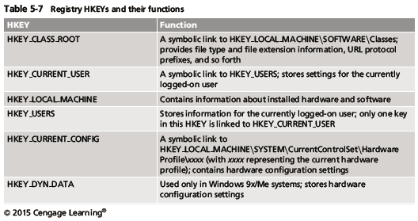

# Chapter 6A

## File Systems
**File system** - Gives OS a road map to data on a disk

Type of file system an OS uses determines how data is stored on the disk

You should be familiar with both the computer’s OS and file systems.

## Boot Sequence

**Complementary Metal Oxide Semiconductor (CMOS)**
Computer stores system configuration and date and time information in the CMOS when power to the system is off

**Basic Input/Output System (BIOS)** or **Extensible Firmware Interface (EFI)** contains programs that perform input and output at the hardware level

**Bootstrap process**
Contained in ROM, tells the computer how to proceed displays the key or keys you press to open the CMOS setup screen CMOS should be modified to boot from a forensic floppy disk or CD.

## Disk Drives

Disk drives are made up of one or more platters coated with magnetic material

**Disk drive components**
- Geometry
- Head
- Tracks
- Cylinders
- Sectors

**Properties handled at the drive’s hardware or firmware level**
- Zone bit recording (ZBR)
- Track density
- Areal density
- Head and cylinder skew

## Solid-State Drives

All flash memory devices have a feature called wear-leveling. An internal firmware feature used in solid-state drives that ensures even wear of read/writes for all memory cells.

When dealing with solid-state devices, making a full forensic copy as soon as possible is crucial. In case you need to recover data from unallocated disk space

## Microsoft File Structures

- In Microsoft file structures, sectors are grouped to form clusters. Storage allocation units of one or more sectors
- Clusters range from 512 bytes up to 32,000 bytes each
- Combining sectors minimizes the overhead of writing or reading files to a disk
- Clusters are numbered sequentially starting at 0 in NTFS and 2 in FAT. First sector of all disks contains a system area, the boot record, and a file structure database
- OS assigns these cluster numbers, called logical addresses
- Sector numbers are called physical addresses
- Clusters and their addresses are specific to a logical disk drive, which is a disk partition

## Disk Partitions
- A partition is a logical drive
- Windows OSs can have three primary partitions followed by an extended partition that can contain one or more logical drives
- Hidden partitions or voids. Large unused gaps between partitions on a disk
- Partition gap. Unused space between partitions
- The partition table is in the Master Boot Record (MBR). Located at sector 0 of the disk drive
- MBR stores information about partitions on a disk and their locations, size, and other important items
- In a hexadecimal editor, you can find the first partition at offset 0x1BE
- The file system’s hexadecimal code is offset 3 bytes from 0x1BE for the first partition

## FAT Disks

**File Allocation Table (FAT)** File structure database that Microsoft originally designed for floppy disks

FAT database is typically written to a disk’s outermost track and contains: Filenames, directory names, date and time stamps, the starting cluster number, and file attributes

Three current FAT versions FAT16, FAT32, and exFAT (used by Xbox game systems) 

Cluster sizes vary according to the hard disk size and file system.

Microsoft OSs allocate disk space for files by clusters results in drive slack unused space in a cluster between the end of an active file and the end of the cluster.

Drive slack includes: RAM slack and file slack.

An unintentional side effect of FAT16 having large clusters was that it reduced fragmentation as cluster size increased.

When you run out of room for an allocated cluster OS allocates another cluster for your file, which creates more slack space on the disk.

As files grow and require more disk space, assigned clusters are chained together the chain can be broken or fragmented.

When the OS stores data in a FAT file system, it assigns a starting cluster position to a file data for the file is written to the first sector of the first assigned cluster.

When this first assigned cluster is filled and runs out of room FAT assigns the next available cluster to the file

If the next available cluster isn’t contiguous to the current cluster file becomes fragmented.

### Deleting FAT Files
In Microsoft OSs, when a file is deleted directory entry is marked as a deleted file with the HEX E5 character replacing the first letter of the filename, FAT chain for that file is set to 0.

Data in the file remains on the disk drive

Area of the disk where the deleted file resides becomes unallocated disk space, available to receive new data from newly created files or other files needing more space.

## NTFS Disks
**NT File System (NTFS)** Introduced with Windows NT, primary file system for Windows 8

**Improvements over FAT file systems**
- NTFS provides more information about a file
- NTFS gives more control over files and folders

NTFS was Microsoft’s move toward a journaling file system, it records a transaction before the system carries it out.

In NTFS, everything written to the disk is considered a file

On an NTFS disk first data set is the Partition Boot Sector, next is Master File Table (MFT)

NTFS results in much less file slack space.

Clusters are smaller for smaller disk drives.

NTFS also uses Unicode

### NTFS System Files
**MFT contains information about all files on the disk** including the system files the OS uses. In the MFT, the **first 15 records** are reserved for system files. **Records** in the MFT are called metadata.

### MFT and File Attributes
In the NTFS MFT All files and folders are stored in separate records of 1024 bytes each

Each record contains file or folder information, this information is divided into record fields containing metadata.

A record field is referred to as an **attribute ID**

File or folder information is typically stored in one of two ways in an MFT record: **Resident and nonresident**

Files larger than 512 bytes are stored outside the MFT, MFT record provides cluster addresses where the file is stored on the drive’s partition, referred to as data runs.

Each MFT record starts with a header identifying it as a resident or nonresident attribute

When a disk is created as an NTFS file structure OS assigns logical clusters to the entire disk partition

These assigned clusters are called **logical cluster numbers (LCNs)**, become the addresses that allow the MFT to link to nonresident files on the disk’s partition

When data is first written to nonresident files, an LCN address is assigned to the file this LCN becomes the file’s **virtual cluster number (VCN)**

### MFT Structures for File Data

**For the header of all MFT records, the record fields of interest are as follows**
- At offset 0x00 - the MFT record identifier FILE
- At offset 0x1C to 0x1F - size of the MFT record
- At offset 0x14 - length of the header (indicates where the next attribute starts)
- At offset 0x32 and 0x33 - the update sequence array, which stores the last 2 bytes of the first sector of the MFT record

### Alternate Data Streams
**Alternate data streams** ways data can be appended to existing files, can obscure valuable evidentiary data, intentionally or by coincidence.

In NTFS, an alternate data stream becomes an additional file attribute allows the file to be associated with different applications

You can only tell whether a file has a data stream attached by examining that file’s MFT entry.

### NTFS Compressed Files
NTFS provides compression similar to FAT DriveSpace 3 (a Windows 98 compression utility)

Under NTFS, files, folders, or entire volumes can be compressed

Most computer forensics tools can uncompress and analyze compressed Windows data

### NTFS Encrypting Files System (EFS)

**Encrypting File System (EFS)** Introduced with Windows 2000, implements a public key and private key method of encrypting files, folders, or disk volumes

When EFS is used in Windows 2000 and later a recovery certificate is generated and sent to the local Windows administrator account

Users can apply EFS to files stored on their local workstations or a remote server

### EFS Recovery Key Agent
Recovery Key Agent implements the recovery certificate which is in the Windows administrator account

Windows administrators can recover a key in two ways: through Windows or from an MS-DOS command prompt

**MS-DOS commands**
- cipher
- copy
- efsrecvr (used to decrypt EFS files)

### Deleting NTFS Files
When a file is deleted in Windows NT and later the OS renames it and moves it to the Recycle Bin.

Can use the Del (delete) MS-DOS command Eliminates the file from the MFT listing in the same way FAT does

## Full Disk Encryption
In recent years, there has been more concern about loss of **Personal identity information (PII)** and trade secrets caused by computer theft. Of particular concern is the theft of laptop computers and other handheld devices. To help prevent loss of information, software vendors now provide whole disk encryption.

**Current whole disk encryption tools offer the following features:**
- Preboot authentication
- Full or partial disk encryption with secure hibernation
- Advanced encryption algorithms
- Key management function

Whole disk encryption tools encrypt each sector of a drive separately

Many of these tools encrypt the drive’s boot sector to prevent any efforts to bypass the secured drive’s partition.

To examine an encrypted drive, decrypt it first, Run a vendor-specific program to decrypt the drive, Many vendors use a bootable CD or USB drive that prompts for a one-time passphrase

### BitLocker
Available Vista Enterprise/Ultimate, Windows 7 and 8 Professional/Enterprise, and Server 08 and 12

**Hardware and software requirements**
- A computer capable of running Windows Vista or later
- The TPM microchip, version 1.2 or newer
- A computer BIOS compliant with Trusted Computing Group (TCG)
- Two NTFS partitions
- The BIOS configured so that the hard drive boots first before checking other bootable peripherals

### Third-Party Disk Encryption Tools
**Some available third-party WDE utilities:**
- PGP Full Disk Encryption
- Voltage SecureFile
- Utimaco SafeGuard Easy
- Jetico BestCrypt Volume Encryption
- TrueCrypt

## Windows Registry
**Registry** A database that stores hardware and software configuration information, network connections, user preferences, and setup information

**To view the Registry, you can use**
- Regedit (Registry Editor) program for Windows 9x systems
- Regedt32 for Windows 2000, XP, and Vista
- Both utilities can be used for Windows 7 and 8

**Registry terminology**
- Registry
- Registry Editor
- HKEY
- Key
- Subkey
- Branch
- Value
- Default value
- Hives

## Microsoft Startup Tasks
Learn what files are accessed when Windows starts

This information helps you determine when a suspect’s computer was last accessed. Important with computers that might have been used after an incident was reported.

### Startup in Windows 7 and Windows 8
Windows 8 is a multiplatform OS that can run on desktops, laptops, tablets, and smartphones

The boot process uses a **boot configuration data (BCD)** store

The BCD contains the boot loader that initiates the system’s bootstrap process. Press F8 or F12 when the system starts to access the Advanced Boot Options

### Startup in Windows NT and Later
**All NTFS computers perform the following steps when the computer is turned on**
- Power-on self test (POST)
- Initial startup
- Boot loader
- Hardware detection and configuration
- Kernel loading
- User logon

**Startup Files for Windows Vista**
- The Ntldr program in Windows XP used to load the OS has been replaced with these three boot utilities:
    - Bootmgr.exe
    - Winload.exe
    - Winresume.exe
- Windows Vista includes the BCD editor for modifying boot options and updating the BCD registry file
- The BCD store replaces the Windows XP boot.ini file

**Startup Files for Windows XP**
- NT Loader (NTLDR)
- Boot.ini
- Ntoskrnl.exe
- Bootvid.dll
- Hal.dll
- BootSect.dos
- NTDetect.com
- NTBootdd.sys
- Pagefile.sys

Contamination Concerns with Windows XP. When you start a Windows XP NTFS workstation, several files are accessed immediately. The last access date and time stamp for the files change to the current date and time and that destroys any potential evidence that shows when a Windows XP workstation was last used.

## Virtual Machines
**Virtual machine** - Allows you to create a representation of another computer on an existing physical computer.

A virtual machine is just a few files on your hard drive must allocate space to it

A virtual machine recognizes components of the physical machine it’s loaded on. Virtual OS is limited by the physical machine’s OS.

In digital forensics Virtual machines make it possible to restore a suspect drive on your virtual machine and run nonstandard software the suspect might have loaded.

From a network forensics standpoint, you need to be aware of some potential issues, such as a virtual machine used to attack another system or network.

# Chapter 6B

## Memory Forensics
Study of data captured from memory of a target system. Ideal analysis includes physical memory data.

**RAM can be analyzed for evidence  as everything in the OS passes through RAM**
- Processes and threads
- Malware (including rootkits)
- Network sockets, URLs, IP Addresses
- Open files
- User generated content (clipboard, passwords, caches, recently searched items)
- Encryption keys
- Hardware and software configuration
- Windows registry keys
- Windows event logs

### Advantages
Best place to identify malicious software activity
- Study running system configuration
- Identify inconsistencies in system
- Bypass packers, binary obfuscators, rootkits and other hiding tools

Analyse and track recent activity on the system
- Identify all recent activity – in context
- Profile user or attacker activities
- Collect evidence that cannot be found anywhere else

Collect evidence that cannot be found anywhere else
- Memory-only malware
- Chat threads
- Internet activities

## Critical Windows Processes

| Process | Explanation |
|-|-|
| Idle | A container that the kernel uses to charge CPU time for idle threads. |
| System | The default home for threads that run in kernel mode. The System process (PID 4) appears to own any sockets or handles to files that kernel modules open. |
| csrss.exe | Located in the system32 directory, it plays a role in creating and deleting processes and threads. Expect to see multiple copies of this. |
| services.exe | Manages Windows services and maintains a list of such services in its private memory space. This process should be the parent for any svchost.exe (service host) instances available, and there should only be one copy of services.exe. It should also run from the system32 directory. |
| svchost.exe | Expect multiple host processes, but note that its parent should be services.exe and run from system32 directory. |
| lsass.exe | The local security authority subsystem process is responsible for enforcing the security policy, verifying passwords, and creating access tokens. It’s often the target of code injection because plaintext password hashes can be found in its private memory space. There should only be one instance of lsass.exe running from the system32 directory. |
| winlogon.exe | This process presents the interactive login prompt, initiates the screensaver when necessary, help load user profiles, and responds to Secure Attention Sequence (SAS) keyboard operations such as Ctrl+Alt+Del. It’s executable is located in the system32 directory. |
| explorer.exe | One explorer.exe process exists for each logged on user and handles a variety of user interactions such as GUI-based folder navigation and Start menu. |
| smss.exe | The session manager is responsible for creating sessions that isolate OS services from the various users who may log in via the console or Remote Desktop Protocol. |

## Process Information
- Name and path
- Command line arguments
- Process ID number (PID)
- Parent PID
- Current working directory
- Window Title
- Handles Files, devices, drivers

List of loaded modules - DLLs

System processes have defined parents E.g. cmd.exe should not be the parent of lsass.exe

- Most user processes are started by Explorer.exe, It’s suspicious when they’re not
    - Maybe started from a command prompt
    - Orphaned process 
    - no PPID or Parent!

Some system processes should never start programs E.g lsass.exe should not start cmd.exe

What if there is no path information or memory mapped files?
- Injected code
- Possible Rootkit
- Where is it on the disk?

Suspicious program names
- Donaldtrump.exe

Suspicious command lines
- C:\TEMP\calc -L -p 1029 -e cmd.exe
- c:\windows\system32\cmd.exe

## Memory Forensics Methodology
Identify rogue processes
Analyse process DLLs and handles
Review network artifacts
Look for evidence of code injection
Check for signs of a rootkit
Dump suspicious process and drivers
Identify rogue processes (Name, path, parent, command line, start time, SID)
Analyse process DLLs and handles (Does the digital signature look suspicious? Frequency of Occurrence?)
Review network artifacts (Suspicious ports, connections, processes)
Look for evidence of code injection (Injected memory sections, process hollowing)
Check for signs of a rootkit (System Service Descriptor Table (SSDT), Interrupt Descriptor Table (IDT), Import Address Table (IAT), I/O Request Packets (IRP) and inline API hooks)
Dump suspicious process and drivers (Review strings, reverse engineering malware)

## Memory Analysis Tools
- [Mandiant Redline](https://www.fireeye.com/services/freeware/redline.html)
- [Volatility](https://github.com/volatilityfoundation/volatility)
- [HBGary Responder Pro](http://www.countertack.com/responder-pro)
- [Rekall](http://www.rekall-forensic.com)