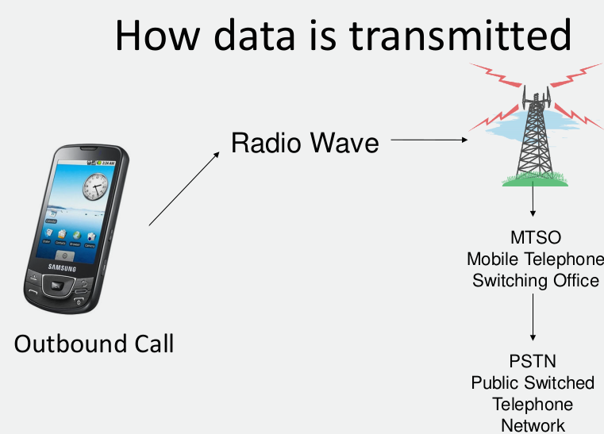
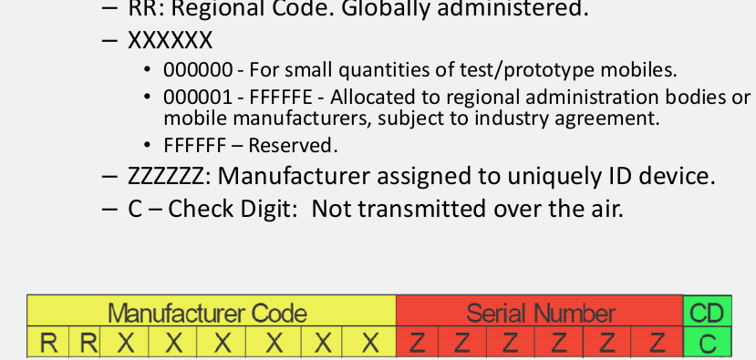
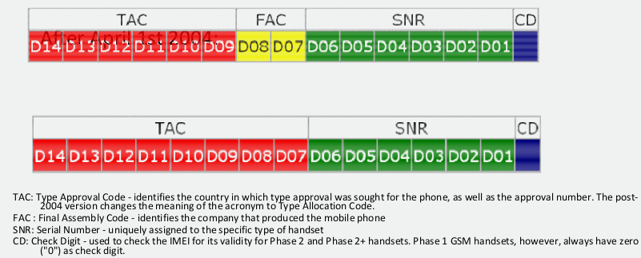
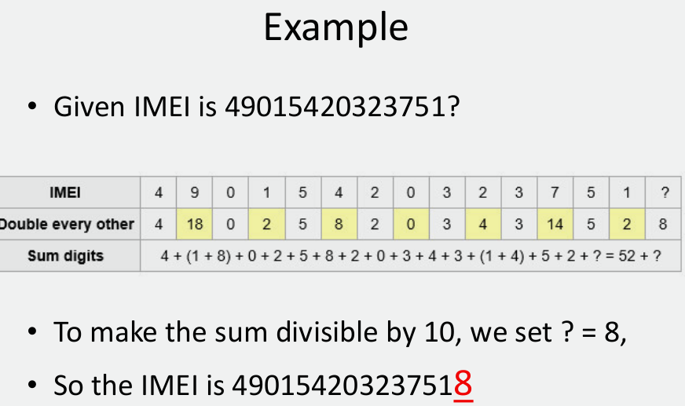
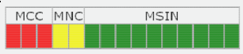

# Cellular & Mobile Networks

- **BTS** - Base Transceiver Station
- **BSC** - Base Station Controller
- **MSC** - Mobile Switching Centre

## MTSO
**Mobile Telephone Switching Office**
- Handles the entire cell network
- Controls handoff
- Communicates with PSTN land-line network
- The Brain of the cell phone network

## Hard Hand Off
- MTSO tells all the towers in the area to listen for **Supervisory Audio Tone (SAT)** of the current tower on the frequency the mobile is transmitting on.
- All the **Base Stations (BS)** that hear the correct SAT on the correct frequency report back to the MTSO the strength of the signal.
- MTSO tells both BSs that a hand-off is comming. New BS allocates voice channels and initiates call setup (auth, encrypt, etc). MTSO tells phone to switch to new frequency and routes call to new BS. Old BS reallocates old frequency for future use.

## Soft Hand Off
- Used by CDMA
- MTSO tells all the towers in the area to service the call the mobile is on.
- All the BS's hear the call report back to the MTSO the strength of the signal.
- MTSO tells BS that reports the higest signal strength to handle the call and all others to drop it. Mobile is now talking through a different tower.

## Access Technologies
- AMPS (Advanced Mobile Phone System) - 1G analog
- TDMA (Time Division Multiple Access) - 2G digital
- iDEN (Integrated Digital Enhanced Network) - 2G digital
- CDMA (Code Division Multiple Access) - 2G digital
- GSM (Global System Mobile Communication) - 2G digital

## TDMA
A method of digitizing and compressing 6 timeslots for each frequency channel.

Divides conversations by frequency and time, devices send bursts of information that are reassembled at the receiving end.

Outdated technology

## iDEN
Based off TDMA, utilizes a SIM, not compatible with GSM, allows user to take advantage of PTT.

### Push to Talk over Cellular
Used by:
- Sprint (iDEN, Boost)
- AT&T (PTT)
- Verizon (PTT)

Dose not use normal airtime minutes, half-duplex
One to one or one to many.

## CDMA
Utilizes spread-specturm technology, spreads information contained in a particular signal of interest over a much greater bandwidth than the original signal.

Assigns a code to each piece of data passed across the spectrum.

Newer techologies still utilize the original CDMA concept.

Unable to carry voice and data at the same time.

## GSM
Established in 1987 as standard available in over 212 countries and territories, 80% of the world's phones.

AKA PCS1900 or DCS1800

Based off of TDMA, increases timeslots from six to eight, utilizes SIM technology.

## Cell Phone Identification Numbers

### MIN - Mobile Identity Number
- 10 digit number (more with country code).
- Assigned by the carrier
- can be ported

### ESN - Electronic Serial Number
Unique 32 bit number assigned to each AMPS, TDMA or CDMA device.

8 bit manufacturer's code almost exhausted. 14 bit code authorized as a fill in untill new system is in place.

### MEID - Mobile Equipment ID
Replaces the soon to be exhausted ESN for CDMA devices.

All of these fields are hexdecimal values.

### IMEI - International Mobile Equipment Identity
A unique 15 digit code used to identify an individual GSM mobile telephone to a mobile network.

**IMEI Checksum Verification**
1. Starting from the right, double every other digit
2. Sum the digits (eg. 14 -> 1+4)
3. Check if the sum is divisble by 10.

## IMSI - International Mobile Subscriber Identity
Always 56 bits and is unique in every network. Consists of
- MCC - Mobile Country Code
- MNC - Mobile Network Code
- MSIN - Mobile Station Identification Number
- In some countries and on some networks, other than GSM, a variation is used where the MNC is 3 digits.

