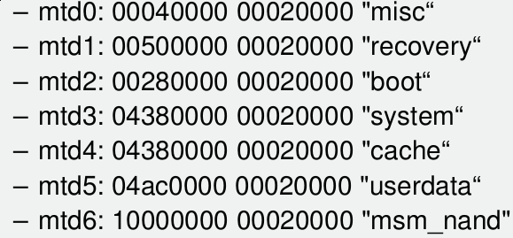

# Android Forensics

**Architecture**
- Applications
- Application Framework - managers
- Libraries - inculdes SQLite
- Android Runtime - Libs and DVM
- Linux Kernel - Drivers

## Android Structure
- Applications run in a separate **Dalvik virtual machine (DVM)** with a unique user and process id - to enforce data security
- Applications can only access the data within their DVM unless another application and the phone owner specifically allows the data to be shared.

## DVM
- Allows multiple applications to be run concurrently each in its own separate VM.
- Compiled into Dalvik executable (.dex) files
- The data is stored in SQLite databases

## Android Security

### Key Security Features
- OS level to Linux kernel security
- Mandatory application sandbox
- Secure interprocess communication
- Application signing
- Application and user granted permissions

## Android Acquisition
In order for a full acquisition of an android device, you will have to make a few changes on the device itself. Enable installation of apps from unknown sources and usb debugging.

make sure you document the steps. you will not alter the device in any way.

## Device Data Areas
**Memory Technology Device (MTD)** subsystem for memory devices - provides flash translation layer.

OS creates `/dev/mtd/mtd0` and `/dev/mtd/mtd0ro` devices

## Finding Data
- dalvik-cache - .dex files that were run
- anr - debug/thread info with timestamps
- app - .apk files
- data - subdirectories per application with sqlite databases
- misc - dhcp, wifi, etc
- system - packages.xml (installed applications)
- checkin.db (lot of connection up/down info)

## Rooting

### Motivation of End Users
- More application sources
- Access unathorized applications
    - Pirated software
- Remove vendor-installed apps (bloatware)
- Access restricted hardware resources

### Motivation of administrator
- Application binary collection for analysis
- Runtime analysis of software
- Filesystem monitoring and profiling
- Penetration testing targets

### Warnings
- Are the jailbreak/root tools secure
- Voiding of warranty
- Error and performance issue
- Dont root/jailbreak your daily driver
- Check organization's legal posture on permitted activities with corporate devices