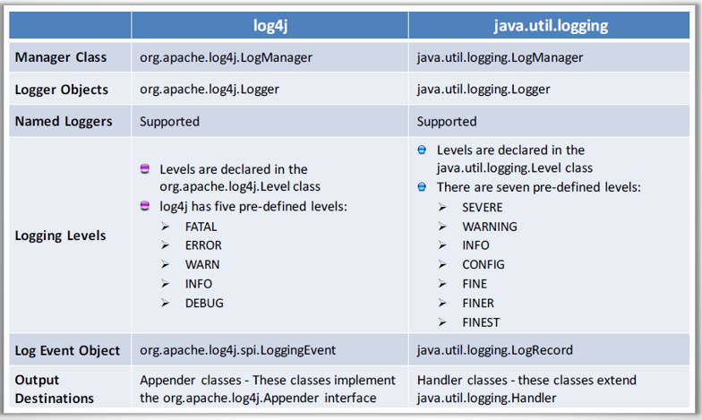

# Secure Coding
## Logging
### log4j
Place log4j2.xml in the src folder. 
```xml
<?xml version="1.0" encoding="UTF-8"?>

<Configuration>
  <Appenders>
    <Console name="Console">
      <PatternLayout pattern="%d{HH:mm:ss.SSS} [%t] %-5level %logger{36} - %msg%n"/>
    </Console>
  </Appenders>
  <Loggers>
    <Root level="info">
      <AppenderRef ref="Console"/>
    </Root>
  </Loggers>
</Configuration>
```

```jsp
<%@ page import="org.apache.logging.log4j.Logger" %>
<%@ page import="org.apache.logging.log4j.LogManager" %>
<%!  Logger logger = LogManager.getRootLogger(); %>
logger.error("Error JSP");
```

### Java logger
```java
import java.io.IOException;
import java.util.logging.Level;
import java.util.logging.Logger;
 
public class LoggerExample {
 
    private static final Logger LOGGER = Logger.getLogger(LoggerExample.class.getName());
    public static void main(String[] args) throws SecurityException, IOException {
 
        LOGGER.info("Logger Name: " + LOGGER.getName());
         
        LOGGER.warning("Can cause ArrayIndexOutOfBoundsException");
         
        //An array of size 3
        int []a = {1,2,3};
        int index = 4;
        LOGGER.config("index is set to " + index);
         
        try{
            System.out.println(a[index]);
        }catch(ArrayIndexOutOfBoundsException ex){
            LOGGER.log(Level.SEVERE, "Exception occur", ex);
        }
    }
}
```


## Exception handling
web.xml
```xml
<error-page>
  	<location>/error.jsp</location>
</error-page>
<error-page>
  	<exception-type>java.lang.Throwable</exception-type>
  	<location>/error.jsp</location>
</error-page>
<error-page>
 	 <error-code>400</error-code>
  	<location>/error.jsp</location>
</error-page>
<error-page>
 	 <error-code>404</error-code>
  	<location>/error.jsp</location>
</error-page>
```

## SQLi Prevention
```java
Connection conn = DBConnection.getConnection();

String sqlStr = "Select * from inventory where functions "
        + "like ? order by brand, model";

PreparedStatement pstmt = conn.prepareStatement(sqlStr);
pstmt.setString(1, "%" + search + "%");

ResultSet rs = pstmt.executeQuery();

while (rs.next()) {		
    id = rs.getString("ID");
    qty = rs.getInt("Quantity");
}
```

## XSS Prevention
```jsp
<%@page import="org.apache.commons.lang3.StringEscapeUtils"%>
StringEscapeUtils.escapeHtml4(search);
```

## Regex
```java
import java.util.regex.*;  
public class RegexExample1{  
  public static void main(String args[]){  
  //1st way  
  Pattern p = Pattern.compile(".s");
  Matcher m = p.matcher("as");  
  boolean b = m.matches();  
    
  //2nd way  
  boolean b2=Pattern.compile(".s").matcher("as").matches();  
    
  //3rd way  
  boolean b3 = Pattern.matches(".s", "as");  
    
  System.out.println(b+" "+b2+" "+b3);  
  }
}
```
```java
import java.util.regex.*;
search = request.getParameter("search");
if (search != null && !search.matches("^[\\w ]+$")) {
    search="";
    firstSearch=true;
}
```
### Password check
The password policy is:
- At least 8 chars
- Contains at least one digit
- Contains at least one lower alpha char and one upper alpha char
- Contains at least one char within a set of special chars (@#%$^ etc.)
- Does not contain space, tab, etc.
```
Try this:

^(?=.*[0-9])(?=.*[a-z])(?=.*[A-Z])(?=.*[@#$%^&+=])(?=\\S+$).{8,}$

Explanation:

^                 # start-of-string
(?=.*[0-9])       # a digit must occur at least once
(?=.*[a-z])       # a lower case letter must occur at least once
(?=.*[A-Z])       # an upper case letter must occur at least once
(?=.*[@#$%^&+=])  # a special character must occur at least once
(?=\S+$)          # no whitespace allowed in the entire string
.{8,}             # anything, at least eight places though
$                 # end-of-string
```
## Session handling
web.xml
```xml
<session-config>
  <session-timeout>15</session-timeout>
   
  <cookie-config>
    <http-only>true</http-only>
    <secure>true</secure>
  </cookie-config>
   
</session-config>
```
Create new session for the user
```java
HttpSession session = request.getSession(false); // get session without creating a new one
if (session != null) {
    session.invalidate();
}
session = request.getSession();
```

## CSRF Prevention
Login
```jsp
<%@ page import="common.hasher, common.login"%>
<%@ page import="java.security.MessageDigest" %>
<%@ page import="java.nio.charset.StandardCharsets" %>
<%@ page import="java.security.SecureRandom" %>
<%@ page import="java.security.NoSuchAlgorithmException" %>
<%!
private String bytesToHex(byte[] bytes) {
	StringBuffer result = new StringBuffer();
	for (byte byt : bytes) result.append(Integer.toString((byt & 0xff) + 0x100, 16).substring(1));
	return result.toString();
}
private String getToken(HttpSession session) throws NoSuchAlgorithmException {
	SecureRandom rand = new SecureRandom();
	MessageDigest digest = MessageDigest.getInstance("SHA-256");
	byte[] rbytes = new byte[40];
	rand.nextBytes(rbytes);
	byte[] sbytes = session.getId().getBytes(StandardCharsets.UTF_8);
	byte[] combined = new byte[rbytes.length + sbytes.length];

	System.arraycopy(rbytes,0,combined,0,rbytes.length);
	System.arraycopy(sbytes,0,combined,rbytes.length,sbytes.length);
	return bytesToHex(digest.digest(combined));
}
%>
<%
String userName = request.getParameter("loginid");
String pass = request.getParameter("password");

login login = new login();

String returnMsg = login.login(userName, pass);
String csrf_token = getToken(session);

int accLevel = login.get_accLevel();
if (accLevel == 99) {
	session.setAttribute("userName", userName);
	session.setAttribute("csrf_token", csrf_token);
} else {
	session.setAttribute("loginMsg", returnMsg);
}
response.sendRedirect("index.jsp");
%>
```
Form
```jsp
<form name="update_Profile" action="updateProfile" method="post">
<!-- CODE TRUNCATED -->
<input type="hidden" name="csrf_token" value=${sessionScope.csrf_token}><br/>
<input type="submit" value="Submit"/>
</form>
```
Servlet
```java
String csrf_token = request.getParameter("csrf_token");

String real_token = (String) request.getSession().getAttribute("csrf_token");
if (!csrf_token.equals(real_token)) {
	System.out.println(csrf_token + " : " + real_token);
	response.sendRedirect("error.jsp");
	return;
}
```

## Password hashing
```java
import org.apache.shiro.crypto.hash.SimpleHash;

private static final int ITERATIONS = 1024;
private static final int RAND_BITS = 256;
private static final int RADIX = Character.MAX_RADIX;

public String hashIt(String password){
	SecureRandom random = new SecureRandom();
	String salt = new BigInteger(RAND_BITS, random).toString(RADIX);
	SimpleHash hash = new SimpleHash("SHA-512", password, salt, ITERATIONS);
	return hash.toHex();
}
```
```java
import java.security.MessageDigest;

private static String bytesToHex(byte[] hash) {
    StringBuffer hexString = new StringBuffer();
    for (int i = 0; i < hash.length; i++) {
    String hex = Integer.toHexString(0xff & hash[i]);
    if(hex.length() == 1) hexString.append('0');
        hexString.append(hex);
    }
    return hexString.toString();
}

MessageDigest digest = MessageDigest.getInstance("SHA-256");
byte[] hashbytes = digest.digest(text.getBytes(StandardCharsets.UTF_8));

String hash = bytesToHex(hashbytes);
```

```java
import org.apache.commons.codec.digest.DigestUtils;

String password = "asdsdasd";
String sha256hex = DigestUtils.sha256Hex(password);
```
